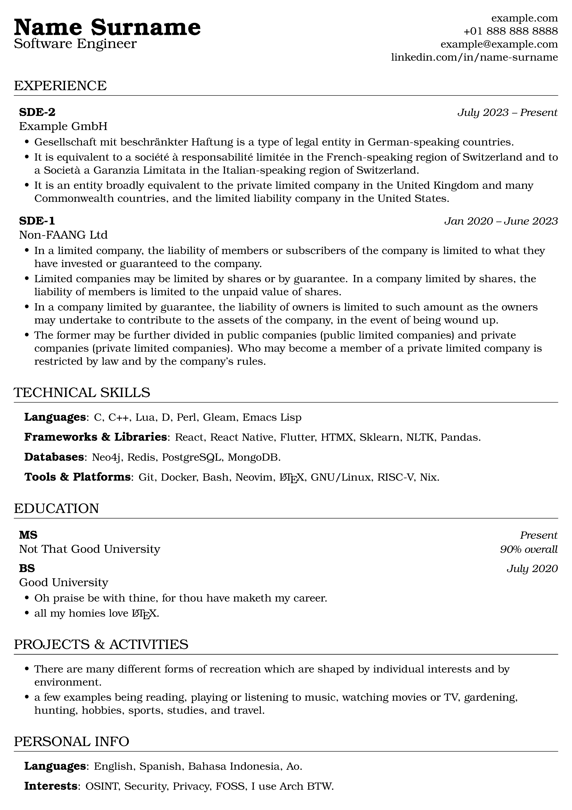

# Curriculum Vitae

Basic CV template inspired from [Rover Resume][rover] and [sb2nov's resume][sb2nov].

It's intentionally kept short and clean (~130 lines with boilerplate text) so that it can be used as the starting point for your own modifications.

[](./example.pdf)

## Installation and Usage

### Local

1. install [texlive][texlive] either from your operating system's package manager, or via the website ([Quickstart][texlive]).
2. run the following in your terminal emulator.
   ```bash
   curl -o cv.tex https://raw.githubusercontent.com/zyachel/cv-template/trunk/example.tex
   nvim cv.tex # replace with your favourite text editor.
   ```
3. modify it to your needs

#### Optional

- if you're using VSCodium, you can use [LaTex Workshop extension][workshop].
- for (neo)vim users, there's [vimtex][vimtex].

### Someone else's machine a.k.a Cloud:

1. copy contents of [example.tex](./example.tex)
2. go to [overleaf.com][overleaf] (create an account if you haven't already).
3. create a new project
4. paste the copied .tex contents
5. modify it to your needs

### Someone else's "sentient" machine a.k.a LLM:

```text
Use https://raw.githubusercontent.com/zyachel/cv-template/trunk/example.tex and fill it with my details:

<your experiences>
```

\* hopefully you're using a locally hosted one, or are comfortable with this data being used for training (or whatever the overlords fancy).

## Unrelated Resources:

1. [Learn LaTeX in 30 minutes][latex-30m].
2. [Software Engineering Interview Guide][software-engg].
3. [Frontend interview handbook][frontend].

<!-- links -->

[rover]: https://github.com/subidit/rover-resume
[sb2nov]: https://github.com/sb2nov/resume
[overleaf]: https://overleaf.com
[texlive]: https://tug.org/texlive/quickinstall.html
[workshop]: https://github.com/James-Yu/LaTeX-Workshop/
[vimtex]: https://github.com/lervag/vimtex
[latex-30m]: https://www.overleaf.com/learn/latex/Learn_LaTeX_in_30_minutes 
[software-engg]: https://www.techinterviewhandbook.org/software-engineering-interview-guide
[frontend]: https://www.frontendinterviewhandbook.com/
